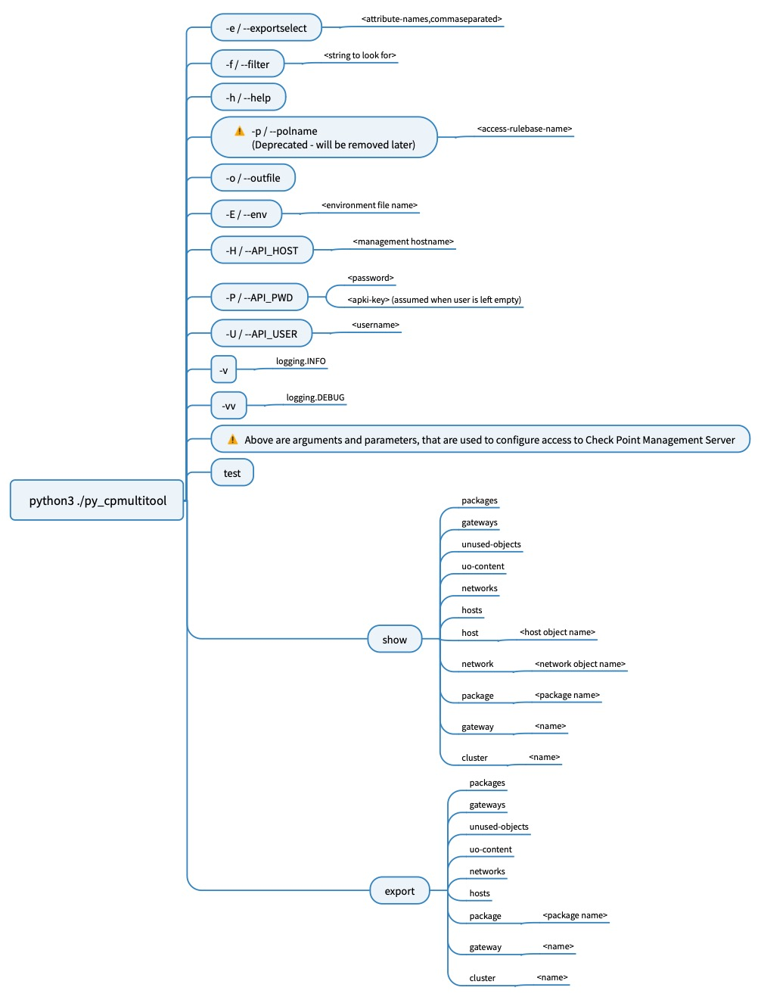

# CP Multitool

## Description

Script for gathering multiple informations out of a Check Point Management Server like "show networks", "show updatable objects" or exporting an access policy directly into XLSX file


## Usage and examples

python cp_multitool show packages

- gets configured policy packages
  - prints them into stdout

python cp_multitool show package "Standard"

- gets given policy package
  - shows used Layers (might be useful to get policy name for "export policy")

python cp_multitool -H cpmgmt -U some-user -P somepassword -o policy.xlsx export policy "Standard Network"

- get policy "Standard Network"
  - writes it into an Excel file given name

python cp_multitool -H cpmgmt -K -P somepassword -e name,uid,comments -o unused.csv export unused-objects

- get unused objects
  - uses attributes name, uid, comments
  - writes them down into a csv file with given name

python cp_multitool -e name,uid,creator show hosts

- gets known host objects
  - prints attributes name, uid,creator

python cp_multitool.py -f auto_feed -e name,uid,comments,creator show networks

- gets network objects
  - filtered by "auto_feed" in attribute name, comments
  - prints attributes "name", "uid", "comments" and "creator"

### description of arguments

#### command line arguments

- -h: printing built in Help
- -H: Check Point Management Server to talk to
- -U: admin username - for all functionalities a "Read Only" permission is enough - but for "test". "show session" seems to be something "special"
- -K: set, when using API Key (with no user). Otherwise you will be asked for a user to enter (leaving blank works too, but when executing automatically...)
- -P: -U-admin´s password or API Key.
- -p: Name of policy you want to export. will be removed later, as it is easier to use third positional argument (export policy "diedsas network")
- -f: filter content by this (uses fields "name, tags, comments")
- -o: set destination filename to write "export" into (format will differ, if pandas is installed and filename contains .xlsx, excel file will be written. otherwise CSV)
- -v: add verbosity, some small hints, where the script is working on
- -vv: more verbosity

#### positional arguments

- first:
  - show / export / test
- second:
  - what to show/export
    - packages, package, policy, hosts, networks, host, network, gateway, cluster, gateways, clusters, unused-objects, uo-content
- third (optional)
  - name of object
    - i.e. policy name, host name, gateway name etc. (if applicable)



## Important

- positional arguments have to be in exact order (first, second (third))
- first command line arguments, THEN positional arguments

## built-in help

```
usage: cp_multitool.py [-h] [-H API_SERVER] [-U API_USER] [-K] [-P API_PWD] [-C API_CONTEXT] [-p POLNAME] [-f CFILTER] [-o OUTFILE] [-e EXPORTSELECT] [-v] {show,export,test} ...

positional arguments:
  {show,export,test}    Tell what to do (test || show || export)
    show                Print given information / objects and their properties (use with caution)
    export              Save output of given information / objects and their properties to a file
    test                Basic connectivity test and (if successful) fetch some information from server

options:
  -h, --help            show this help message and exit

  -H API_SERVER, --api_server API_SERVER
                        Target Host (CP Management Server)

  -U API_USER, --api_user API_USER
                        API User

  -K, --key             invoke, that password value is an API Key

  -P API_PWD, --api_pwd API_PWD
                        API Users Password, if using API Key, use this without a user

  -C API_CONTEXT, --api_context API_CONTEXT
                        If SmartCloud-1 is used, enter context information here (i.e. bhkjnkm-knjhbas-d32424b/web_api) - for On Prem enter "-C none"

  -p POLNAME, --polname POLNAME
                        when using "show-access-rulebase" a policy name must be given, using this argument

  -f CFILTER, --filter CFILTER
                        filter by string (if applicable)

  -o OUTFILE, --outfile OUTFILE
                        filename, to save the output in

  -e EXPORTSELECT, --exportselect EXPORTSELECT
                        choose which fields to export to csv (define as string with quotes: "name, ip_address, uid, groups")

  -v, --verbose         Run Script with informational (-v) or debugging (-vv) logging output. For troubleshooting purposes.

```


## Features that might (!) come

- [ ] See what happened to conditional formatting (does not apply anymore), perhaps thanks to M$?
- [x] show/export unused objects
- [ ] show/export zerohit rules from given rulebase
